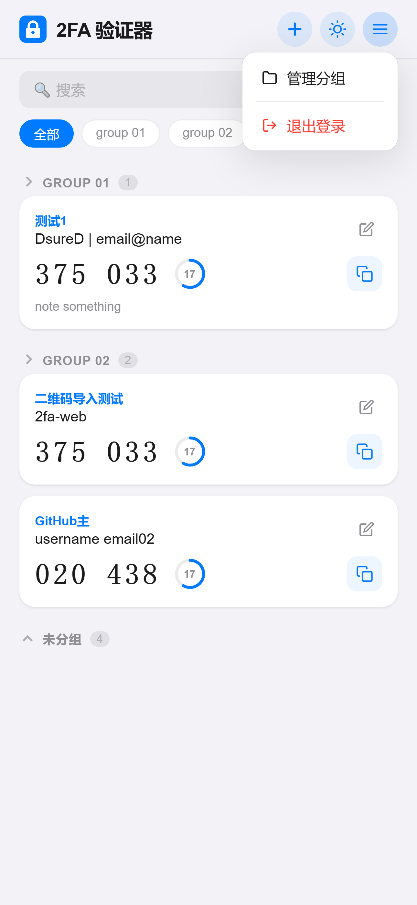
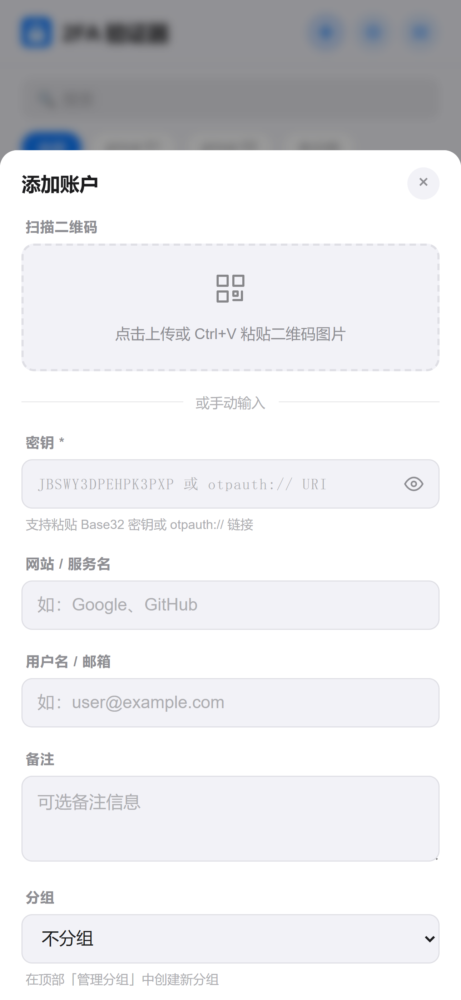
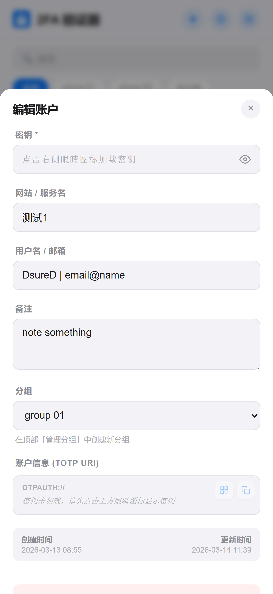
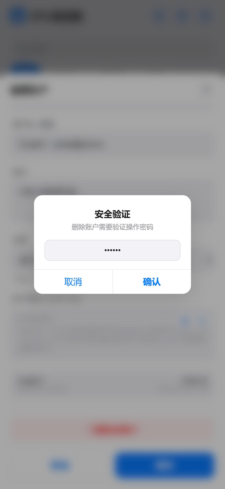

<div align="center">

中文 | [English](README_EN.md)

# 2FA Web Authenticator

**一个优雅、安全、开箱即用的网页版两步验证器。**

告别手机 App 的束缚 —— 在任何浏览器中管理你的 TOTP 验证码，自托管部署，数据完全由你掌控。

</div>

---

## 为什么选择 2FA Web？

### 随时随地访问

不再需要掏出手机打开 Google Authenticator。打开浏览器，输入密码，验证码就在眼前。点击即复制，效率翻倍。

### 极致轻量

整个项目只有 **1 个 Python 文件 + 1 个 HTML 文件**，仅依赖 3 个 Python 包。没有 Node.js，没有构建步骤，没有繁琐的配置。`pip install` 之后直接运行，30 秒内完成部署。

### Apple 设计风格

精心打造的 UI，毛玻璃效果、圆角卡片、流畅动画、环形倒计时。支持浅色 / 深色 / 跟随系统三种主题模式，移动端与桌面端完美适配。

### 多层安全防护

从网络层到数据层，六道安全屏障保护你的账户：

| 层级 | 防护措施 |
|------|---------|
| 网络层 | 严格 CSP 策略、X-Frame-Options DENY、CDN 资源 SRI 校验 |
| 人机验证 | 可选 hCaptcha 集成（invisible 模式，无感验证） |
| 频率限制 | 5 分钟内最多 5 次失败登录，IP 级别锁定 |
| 密码安全 | 常数时间比较（`hmac.compare_digest`），防止时序攻击 |
| 会话安全 | HttpOnly / SameSite=Lax / Secure Cookie，12 小时自动过期 |
| 敏感操作 | 查看密钥、删除账户需要二次密码验证 |

### 数据自主可控

所有数据存储在本地 SQLite 数据库中，不依赖任何第三方云服务。你的密钥永远不会离开你的服务器。

---
## DEMO
<p align="center">
  
  
  
  
  
</p>

---
## 功能一览

- **验证码管理** — 添加、编辑、删除 TOTP 账户，实时显示 6 位 / 8 位验证码
- **智能刷新** — 本地秒级倒计时 + 到期自动拉取，流畅无闪烁
- **二维码扫描** — 上传图片或 Ctrl+V 粘贴二维码，自动解析 otpauth:// URI
- **二维码导出** — 一键生成账户二维码，方便迁移到手机 App
- **分组管理** — 按服务分组，快速筛选，支持创建 / 重命名 / 删除 / 拖拽排序
- **搜索过滤** — 按网站名、用户名、备注、分组实时搜索
- **一键复制** — 点击验证码或复制按钮，自动写入剪贴板
- **多算法支持** — SHA1 / SHA256 / SHA512 算法，30s / 60s 周期
- **主题切换** — 浅色 / 深色 / 跟随系统，偏好本地持久化
- **响应式布局** — 手机、平板、桌面端完美适配，支持 PWA safe-area
- **hCaptcha** — 可选启用，invisible 模式无感人机验证

---

## 快速开始

### 环境要求

- Python 3.8+

### 安装与运行

```bash
# 克隆项目
git clone https://github.com/DsureD/2fa-web.git
cd 2fa-web

# 安装依赖
pip install -r requirements.txt

# 配置环境变量
cp .env.example .env
# 编辑 .env，设置你的密码和密钥

# 启动
python app.py
```

打开浏览器访问 `http://localhost:5000`，输入密码即可使用。

### 环境变量

在项目根目录创建 `.env` 文件进行配置：

```ini
# 必填 - 登录密码
ACCESS_PASSWORD=your_strong_password_here

# 可选 - 敏感操作二次验证密码（查看密钥/删除账户时需要，留空则不启用）
SENSITIVE_PASSWORD=

# 可选 - hCaptcha 人机验证（留空则不启用）
HCAPTCHA_SITE_KEY=
HCAPTCHA_SECRET_KEY=

# Flask Session 密钥（建议设置为随机长字符串）
SECRET_KEY=change_me_to_a_random_string

# 服务监听配置
HOST=0.0.0.0
PORT=5000
DEBUG=false
```

---

## 生产部署建议

推荐使用 **Nginx 反向代理 + HTTPS** 部署：

```nginx
server {
    listen 443 ssl http2;
    server_name 2fa.yourdomain.com;

    ssl_certificate     /path/to/cert.pem;
    ssl_certificate_key /path/to/key.pem;

    location / {
        proxy_pass http://127.0.0.1:5000;
        proxy_set_header Host $host;
        proxy_set_header X-Real-IP $remote_addr;
        proxy_set_header X-Forwarded-For $proxy_add_x_forwarded_for;
        proxy_set_header X-Forwarded-Proto $scheme;
    }
}
```

> **重要提示**：生产环境务必通过 HTTPS 访问。应用在非 DEBUG 模式下会自动启用 Secure Cookie，要求 HTTPS 连接。

---

## 技术栈

| 组件 | 技术 |
|------|------|
| 后端 | Python / Flask 3.1 |
| 数据库 | SQLite（WAL 模式） |
| TOTP | PyOTP 2.9 |
| 前端 | 原生 HTML / CSS / JS（无框架） |
| 二维码解析 | jsQR 1.4（CDN + SRI） |
| 二维码生成 | qrcode-generator 1.4（CDN + SRI） |
| 人机验证 | hCaptcha（可选） |

---

## 项目结构

```
2fa-web/
  app.py              # 后端：全部 API 与业务逻辑
  templates/
    index.html         # 前端：完整的单页应用
  requirements.txt     # Python 依赖（仅 3 个）
  .env                 # 环境配置（不纳入版本控制）
  2fa.db               # SQLite 数据库（自动创建）
```

没有 Webpack，没有 Babel，没有 node_modules。整个项目拷贝到任何机器上都能直接跑。

---

## API 参考

| 方法 | 路径 | 说明 |
|------|------|------|
| `POST` | `/api/login` | 登录（频率限制 + hCaptcha） |
| `POST` | `/api/logout` | 登出 |
| `GET` | `/api/status` | 登录状态与配置信息 |
| `GET` | `/api/accounts` | 获取所有账户与实时验证码 |
| `POST` | `/api/accounts` | 添加账户 |
| `PUT` | `/api/accounts/<id>` | 更新账户 |
| `DELETE` | `/api/accounts/<id>` | 删除账户（需敏感密码） |
| `GET` | `/api/totp/<id>` | 获取单个验证码 |
| `POST` | `/api/accounts/<id>/secret` | 获取密钥（需敏感密码） |
| `GET` | `/api/groups` | 分组列表 |
| `POST` | `/api/groups` | 创建分组 |
| `POST` | `/api/groups/rename` | 重命名分组 |
| `POST` | `/api/groups/reorder` | 分组拖拽排序 |
| `DELETE` | `/api/groups` | 删除分组 |

---

## 安全说明

- TOTP 密钥在数据库中明文存储，安全性依赖于服务器的文件系统权限和访问控制。请确保服务器本身的安全。
- 登录频率限制基于内存，服务重启后重置。
- 外部 JS 库通过 CDN 加载并配置了 SRI（Subresource Integrity）校验，确保资源未被篡改。
- 建议在生产环境中限制访问来源 IP，或部署在内网 / VPN 环境中。

---

## 许可证

MIT License